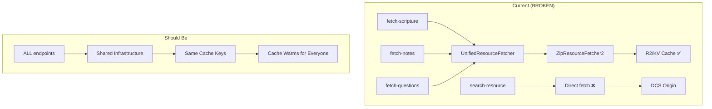

# The Real Search Performance Fix

## The Problem (Correctly Identified This Time)

The search worker (`/api/internal/search-resource`) is **completely bypassing** the existing caching infrastructure that every other endpoint uses successfully.

### What's Currently Happening

```javascript
// search-resource worker - WRONG APPROACH
async function fetchZip(zipUrl: string): Promise<ArrayBuffer> {
  const response = await fetch(zipUrl, {  // Direct fetch, no cache!
    headers: { 'User-Agent': '...' },
    signal: AbortSignal.timeout(5000)
  });
  // ...
}
```

### What Everyone Else Does

```javascript
// All other endpoints use UnifiedResourceFetcher → ZipResourceFetcher2
const fetcher = new UnifiedResourceFetcher(tracer);
// This automatically uses:
// - R2 bucket caching (7 days)
// - Cache API (7 days)
// - KV caching (1 hour for catalogs)
// - Consistent cache keys
```

## The Architecture Violation



## Why This Matters SO MUCH

When `fetch-scripture` downloads `en_ult.zip`:

- It stores in R2 with key: `https://git.door43.org/unfoldingWord/en_ult/archive/master.zip`
- Cache TTL: 7 days

When search tries to search `en_ult`:

- It downloads THE SAME ZIP from origin
- Takes 5+ seconds
- Times out
- **Doesn't use or warm the cache that already has it!**

## The Actual Fix (Not What I Said Before)

### Option 1: Use ZipResourceFetcher2 Directly (Recommended)

```javascript
// ui/src/routes/api/internal/search-resource/+server.ts

import { ZipResourceFetcher2 } from '$lib/../../../src/services/ZipResourceFetcher2.js';
import { EdgeXRayTracer } from '$lib/../../../src/functions/edge-xray.js';

export const POST: RequestHandler = async ({ request, platform }) => {
  const body: ResourceSearchRequest = await request.json();
  const { resource, zipUrl, query, reference, type } = body;

  // Create fetcher with proper caching
  const tracer = new EdgeXRayTracer(`search-${Date.now()}`, 'search-resource');
  const zipFetcher = new ZipResourceFetcher2(tracer);

  // Parse org and repo from resource name
  // e.g., "en_ult" → org: "unfoldingWord", repo: "en_ult"
  const [lang, ...rest] = resource.split('_');
  const repo = resource;
  const org = body.owner || 'unfoldingWord';

  // Use the SAME method that everyone else uses!
  const zipData = await zipFetcher.getOrDownloadZip(
    org,
    repo,
    'master',  // or extract from zipUrl
    zipUrl
  );

  if (!zipData) {
    throw new Error(`Failed to get ZIP for ${resource}`);
  }

  // Continue with existing unzip and index logic
  const entries = fflate.unzipSync(zipData);
  // ... rest of the search logic
```

### Option 2: Extract ZIP URL to Org/Repo/Ref

Since the orchestrator passes `zipUrl`, we need to parse it:

```javascript
function parseZipUrl(zipUrl: string): { org: string; repo: string; ref: string } {
  // https://git.door43.org/unfoldingWord/en_ult/archive/master.zip
  const match = zipUrl.match(/git\.door43\.org\/([^/]+)\/([^/]+)\/archive\/([^.]+)\.zip/);
  if (!match) {
    throw new Error(`Invalid ZIP URL format: ${zipUrl}`);
  }
  return {
    org: match[1],
    repo: match[2],
    ref: match[3]
  };
}
```

## Cache Key Consistency

The critical part is that `ZipResourceFetcher2` uses `r2KeyFromUrl` which generates consistent keys:

```javascript
// In r2-keys.js
export function r2KeyFromUrl(url) {
  // Normalizes the URL to a consistent key
  // https://git.door43.org/unfoldingWord/en_ult/archive/master.zip
  // becomes a consistent R2 key that ALL consumers use
}
```

This means:

1. When scripture endpoint caches a ZIP, search can use it
2. When search caches a ZIP, scripture can use it
3. **They warm each other's caches!**

## Expected Performance After Fix

### Current (No Cache Sharing)

- First scripture fetch: 5s (downloads ZIP, caches it)
- First search: 9s (downloads SAME ZIP again!)
- Second scripture: 60ms (uses cache)
- Second search: 9s (still downloading!)

### Fixed (Shared Cache)

- First scripture fetch: 5s (downloads ZIP, caches it)
- First search: 1.5s (uses cached ZIP!)
- Second scripture: 60ms (uses cache)
- Second search: 1.5s (uses cache)

## Implementation Effort

1. **Import ZipResourceFetcher2** into search worker
2. **Parse ZIP URL** to get org/repo/ref
3. **Use getOrDownloadZip()** instead of direct fetch
4. **Remove the custom fetchZip function**

That's it. Maybe 50 lines of code changes.

## Why I Missed This Initially

I was proposing to "add R2 caching" when the R2 caching already exists and is working perfectly. The problem isn't missing infrastructure—it's that the search worker is the ONLY endpoint not using the existing infrastructure.

It's like having a highway but taking surface streets because you forgot the on-ramp exists.

## Testing the Fix

1. Clear all caches
2. Hit scripture endpoint for John 3:16
3. Immediately search for "love"
4. Search should be fast (uses scripture's cached ZIP)

Or:

1. Clear all caches
2. Search for "faith"
3. Immediately hit scripture endpoint
4. Scripture should be fast (uses search's cached ZIP)

## The Lesson

**ALWAYS USE THE SAME FETCHING STACK**

Every endpoint should go through the same layers:

- UnifiedResourceFetcher or ZipResourceFetcher2
- R2Storage with consistent keys
- Same cache warming patterns

Don't reinvent the wheel. Especially when the wheel is already spinning at 60mph next door.

---

_"I spent all day looking for my glasses. They were on my head."_ - Me, apparently
