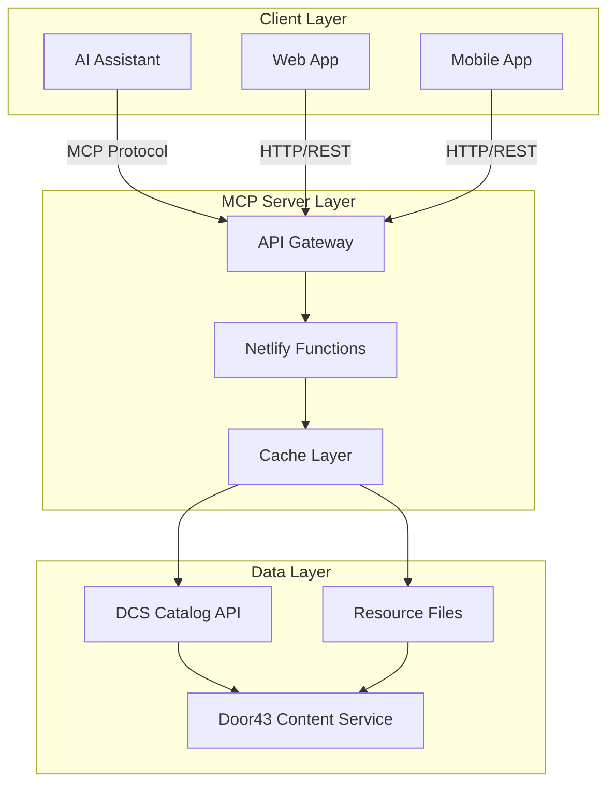

# MCP Translation Helps Architecture

This document describes the architecture of the Translation Helps MCP (Model Context Protocol) server, which provides Bible translation resources through Netlify Functions for consumption by AI assistants and applications.

## Table of Contents

1. [System Overview](#system-overview)
2. [Architecture Principles](#architecture-principles)
3. [Component Architecture](#component-architecture)
4. [Data Flow](#data-flow)
5. [API Design](#api-design)
6. [Performance Optimization](#performance-optimization)
7. [Error Handling](#error-handling)
8. [Security Considerations](#security-considerations)

## System Overview

The Translation Helps MCP server is a serverless implementation that:

- Provides a unified interface to Door43 Content Service (DCS) resources
- Optimizes data for AI/LLM consumption
- Implements intelligent caching and performance optimization
- Supports multiple organizations and languages



## Architecture Principles

### 1. Serverless First

- No server maintenance
- Automatic scaling
- Pay-per-use model
- Global edge deployment

### 2. Cache Everything

- Multi-level caching strategy
- TTL-based invalidation
- Request deduplication
- Fallback to stale data

### 3. LLM Optimization

- Clean text extraction
- Minimal markup
- Consistent formatting
- Accurate quotability

### 4. API Simplicity

- RESTful design
- Clear parameter names
- Predictable responses
- Comprehensive errors

## Component Architecture

### Core Components

#### 1. API Gateway (Netlify Functions)

```javascript
// netlify/functions/fetch-resources.js
export async function handler(event, context) {
  const { organization, language, reference } = event.queryStringParameters;

  try {
    // Parse reference
    const { book, chapter, verse } = parseReference(reference);

    // Fetch with caching
    const resources = await resourceAggregator.fetch({
      organization,
      language,
      book,
      chapter,
      verse,
    });

    return {
      statusCode: 200,
      body: JSON.stringify(resources),
      headers: {
        "Content-Type": "application/json",
        "Cache-Control": "public, max-age=300",
      },
    };
  } catch (error) {
    return handleError(error);
  }
}
```

#### 2. Resource Aggregator

```javascript
class ResourceAggregator {
  constructor(cache) {
    this.cache = cache;
    this.catalogService = new CatalogService(cache);
    this.scriptureService = new ScriptureService(cache);
    this.notesService = new NotesService(cache);
  }

  async fetch({ organization, language, book, chapter, verse }) {
    // Parallel fetch all resource types
    const [scripture, notes, questions, words] = await Promise.all([
      this.scriptureService.fetch({ organization, language, book, chapter, verse }),
      this.notesService.fetch({ organization, language, book, chapter, verse }),
      this.questionsService.fetch({ organization, language, book, chapter, verse }),
      this.wordsService.fetch({ organization, language, book, chapter, verse }),
    ]);

    return {
      reference: { book, chapter, verse },
      scripture: this.extractCleanText(scripture),
      translationNotes: notes,
      translationQuestions: questions,
      translationWords: words,
      metadata: {
        organization,
        language,
        timestamp: new Date().toISOString(),
      },
    };
  }

  extractCleanText(usfmContent) {
    // Implement USFM extraction logic
    return usfmTextExtractor.extract(usfmContent);
  }
}
```

#### 3. Cache Manager

```javascript
class CacheManager {
  constructor() {
    this.memory = new Map();
    this.pending = new Map();
  }

  async get(key, fetcher, ttl = 300000) {
    // Check memory cache
    const cached = this.memory.get(key);
    if (cached && Date.now() - cached.time < ttl) {
      return cached.data;
    }

    // Check pending requests
    if (this.pending.has(key)) {
      return await this.pending.get(key);
    }

    // Fetch and cache
    const promise = fetcher()
      .then((data) => {
        this.memory.set(key, { data, time: Date.now() });
        this.pending.delete(key);
        return data;
      })
      .catch((error) => {
        this.pending.delete(key);
        throw error;
      });

    this.pending.set(key, promise);
    return promise;
  }
}
```

#### 4. USFM Text Extractor

```javascript
class USFMTextExtractor {
  extract(usfmContent, chapter, verse) {
    // Remove alignment markers
    let text = usfmContent;
    text = text.replace(/\\zaln-s[^\\]*\\zaln-e\*/g, "");
    text = text.replace(/\\zaln-[se][^\\]*/g, "");

    // Remove word markers but keep content
    text = text.replace(/\\w\s+([^|\\]*)\|[^\\]*\\w\*/g, "$1");

    // Extract specific verse
    if (chapter && verse) {
      return this.extractVerse(text, chapter, verse);
    }

    return text.trim();
  }

  extractVerse(usfmText, chapter, verse) {
    // Implementation as shown in USFM_LLM_PREPARATION_GUIDE.md
  }
}
```

## Data Flow

### 1. Request Flow

```
Client Request → API Gateway → Function Handler → Resource Aggregator
                                                           ↓
                                                    Cache Check
                                                           ↓
                                                  [Cache Hit/Miss]
                                                     ↓        ↓
                                              Return Cached   Fetch from DCS
                                                              ↓
                                                        Process & Cache
                                                              ↓
Client Response ← API Gateway ← Function Handler ← Resource Aggregator
```

### 2. Caching Strategy

```
Level 1: Function Memory Cache (5 min TTL)
  ↓ Miss
Level 2: Request Deduplication (prevents duplicate API calls)
  ↓ Miss
Level 3: DCS API Call
  ↓
Store in all cache levels
```

## API Design

### Endpoints

#### 1. Fetch Resources

```
GET /fetch-resources
```

**Parameters:**

- `organization` (required): Organization ID (e.g., "unfoldingWord")
- `language` (required): Language code (e.g., "en", "es")
- `reference` (required): Scripture reference (e.g., "John 3:16")
- `resources` (optional): Comma-separated resource types to include

**Response:**

```json
{
  "reference": {
    "book": "JHN",
    "chapter": 3,
    "verse": 16,
    "bookName": "John"
  },
  "scripture": {
    "text": "16 For God so loved the world...",
    "version": "ULT",
    "copyright": "Public Domain"
  },
  "translationNotes": [...],
  "translationQuestions": [...],
  "translationWords": [...],
  "metadata": {
    "organization": "unfoldingWord",
    "language": "en",
    "timestamp": "2024-01-27T10:00:00Z"
  }
}
```

#### 2. Get Languages

```
GET /get-languages
```

**Parameters:**

- `organization` (required): Organization ID

**Response:**

```json
{
  "languages": [
    {
      "code": "en",
      "name": "English",
      "direction": "ltr",
      "gateway": true
    }
  ]
}
```

#### 3. Get Organizations

```
GET /get-organizations
```

**Response:**

```json
{
  "organizations": [
    {
      "id": "unfoldingWord",
      "name": "unfoldingWord®",
      "languages": ["en", "es", "fr"]
    }
  ]
}
```

## Performance Optimization

### 1. Parallel Resource Fetching

```javascript
// Fetch all resources in parallel
const resources = await Promise.all([
  fetchScripture(params),
  fetchNotes(params),
  fetchQuestions(params),
  fetchWords(params),
]);
```

### 2. Request Deduplication

```javascript
// Prevent multiple identical requests
if (pendingRequests.has(cacheKey)) {
  return await pendingRequests.get(cacheKey);
}
```

### 3. Intelligent Caching

- Organizations: 1 hour TTL
- Languages: 1 hour TTL
- Resources metadata: 5 minutes TTL
- Resource content: 10 minutes TTL

### 4. Edge Deployment

- Netlify automatically deploys to global edge locations
- Reduces latency for worldwide users
- No configuration required

## Error Handling

### Error Response Format

```json
{
  "error": {
    "code": "RESOURCE_NOT_FOUND",
    "message": "The requested resource was not found",
    "details": {
      "organization": "unfoldingWord",
      "language": "en",
      "resource": "tn",
      "book": "GEN"
    }
  }
}
```

### Error Codes

- `INVALID_REFERENCE`: Scripture reference format is invalid
- `RESOURCE_NOT_FOUND`: Requested resource doesn't exist
- `ORGANIZATION_NOT_FOUND`: Organization doesn't exist
- `LANGUAGE_NOT_FOUND`: Language not available
- `UPSTREAM_ERROR`: DCS API error
- `INTERNAL_ERROR`: Server error

### Graceful Degradation

```javascript
try {
  // Try primary method
  return await fetchWithCache(url);
} catch (error) {
  // Try fallback
  const cached = getCachedEvenIfStale(url);
  if (cached) return cached;

  // Return partial response
  return {
    error: formatError(error),
    partial: true,
  };
}
```

## Security Considerations

### 1. Input Validation

```javascript
function validateReference(reference) {
  const pattern = /^(\d?\s*\w+)\s+(\d+)(?::(\d+))?$/;
  if (!pattern.test(reference)) {
    throw new ValidationError("Invalid reference format");
  }
}
```

### 2. Rate Limiting

- Netlify provides automatic rate limiting
- Additional application-level limiting can be added

### 3. CORS Configuration

```javascript
const headers = {
  "Access-Control-Allow-Origin": process.env.ALLOWED_ORIGINS || "*",
  "Access-Control-Allow-Methods": "GET, OPTIONS",
  "Access-Control-Allow-Headers": "Content-Type",
};
```

### 4. No Sensitive Data

- All data is public domain
- No authentication required
- No personal data stored

## MCP Tool Implementation

### Tool Registration

```javascript
const tools = {
  "fetch-resources": {
    description: "Fetch Bible translation resources",
    parameters: {
      organization: { type: "string", required: true },
      language: { type: "string", required: true },
      reference: { type: "string", required: true },
    },
    handler: fetchResourcesHandler,
  },
  "get-languages": {
    description: "Get available languages for an organization",
    parameters: {
      organization: { type: "string", required: true },
    },
    handler: getLanguagesHandler,
  },
};
```

### MCP Server Implementation

```javascript
class TranslationHelpsMCPServer {
  constructor() {
    this.resourceAggregator = new ResourceAggregator();
  }

  async handleRequest(tool, params) {
    switch (tool) {
      case "fetch-resources":
        return await this.fetchResources(params);
      case "get-languages":
        return await this.getLanguages(params);
      default:
        throw new Error(`Unknown tool: ${tool}`);
    }
  }
}
```

## Deployment

### Netlify Configuration

```toml
# netlify.toml
[build]
  functions = "netlify/functions"

[functions]
  directory = "netlify/functions"
  node_bundler = "esbuild"

[[headers]]
  for = "/api/*"
  [headers.values]
    Cache-Control = "public, max-age=300"
```

### Environment Variables

None required - all data sources are public.

## Monitoring

### Key Metrics

1. **Function invocations**: Track usage patterns
2. **Response times**: Monitor performance
3. **Error rates**: Identify issues
4. **Cache hit rates**: Optimize caching

### Logging

```javascript
console.log({
  level: "info",
  event: "resource_fetch",
  organization,
  language,
  reference,
  duration: Date.now() - startTime,
  cacheHit: cached,
});
```

## Future Enhancements

1. **WebSocket Support**: Real-time updates
2. **Batch Operations**: Multiple references in one request
3. **Search Functionality**: Find resources by content
4. **Offline Support**: Progressive Web App capabilities
5. **Analytics Dashboard**: Usage insights

This architecture provides a robust, scalable, and performant foundation for delivering Bible translation resources to AI assistants and applications worldwide.
